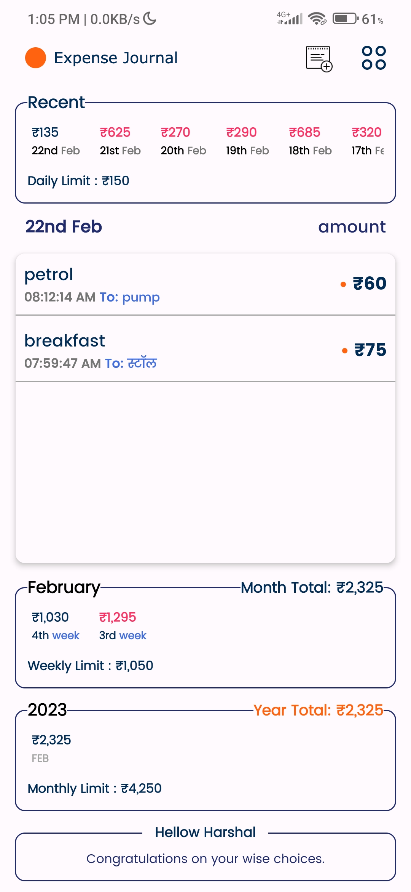

## Expense Journal
[](https://github.com/KotlinBy/awesome-kotlin)
<a name="readme-top"></a>
 <p align="left">
 A lightweight minimalistic spending tracker to helps us keep monitoring our expenses.
 </p>
  
 No time to have a look at project ?
<a href="https://github.com/harshaltilay/ExpenseJournal/raw/master/ExpenseJournal.apk">
    Just download the apk to see it in action
</a>

<a href="https://github.com/harshaltilay/ExpenseJournal">
    
</a>


#### We are using...

1) Kotlin
2) Generics
3) HILT2
4) Flow basics
5) RoomDB
6) Navigation Component
7) Android Studio IDE

App consist of two screens.
1) Profile screen where user set his name and mention daily, weekly and monthly max spending targets. 
2) Main screen that constantly shows user his daily, weekly, monthly spending details and whether the limits set is exceeded or not...

#### The code is divided in to five layers of CLEAN Architecture Pattern which is highly useful for conducting unit, integration and UI testing as well as better code management when the team and number of aap screens  are very big.
<b>1. Presentation.</b><br> 
<b>2. Use cases.</b><br> 
<b>3. Domain.</b><br> 
<b>4. Data.</b><br> 
<b>5. Framework.</b><br> 

<p align="right">(<a href="#readme-top">back to top</a>)</p>

### License
```
   Copyright (C) 2023 HARSHAL TILAY

   Licensed under the Apache License, Version 2.0 (the "License");
   you may not use this file except in compliance with the License.
   You may obtain a copy of the License at

       http://www.apache.org/licenses/LICENSE-2.0

   Unless required by applicable law or agreed to in writing, software
   distributed under the License is distributed on an "AS IS" BASIS,
   WITHOUT WARRANTIES OR CONDITIONS OF ANY KIND, either express or implied.
   See the License for the specific language governing permissions and
   limitations under the License.
```
<p align="right">(<a href="#readme-top">back to top</a>)</p>


<!-- CONTACT -->
## Developer Info
Name: Harshal Tilay</br>
Country: India (GMT+5.30)</br></br>
Android Studio | VS Code | Unity | Sublimetext</br>
Kotlin | Java | C# | C++ JNI (Working knowledge)</br>
HTML | JavaScript | PHP <br>
NoSQL| MySQL | SQLite | Google App Engine | Firebase/FireStore</br>
REST | JSON | GraphQL | XML</br>
SmartFox Server | Photon Cloud/Server | Custom Socket Servers | Amazon Image Rekognition API</br>
Git | Jira</br>
Windows | MacOS</br>


## Disclaimer
This is my hobby project mostly completed in spare time and has been developed on Emulator only. If you face any issue please let me know further. 
This is an offline app so if you uninstall it then you will loose all your existing data.
<p align="right">(<a href="#readme-top">back to top</a>)</p>

